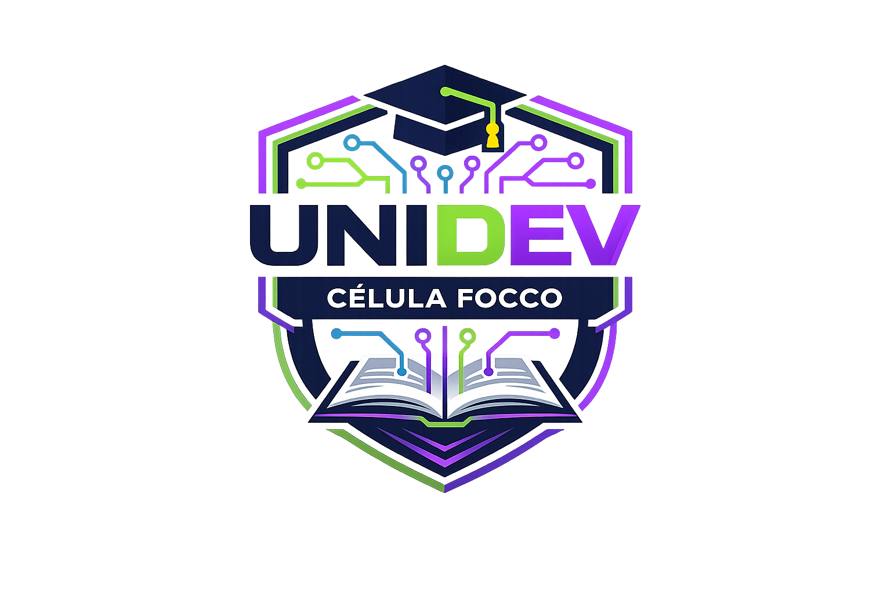

# UNIDEV - Unindo Desenvolvedores 🚀

  

---

## 📖 Sobre a Célula
A **UNIDEV** é uma célula de estudos dedicada ao aprendizado colaborativo de **programação, lógica e fundamentos de desenvolvimento**. Nosso objetivo é formar uma comunidade sólida de alunos que aprendem, praticam e evoluem juntos, preparando-se para os desafios do mercado de tecnologia.

## 👤 Articulador
* **João Vitor Costa**

## 🗓️ Cronograma e Localização
Os nossos encontros presenciais acontecem semanalmente:

- **📅 Dia:** Quinta-feira
- **⏰ Horário:** 17:00 às 19:00
- **📍 Local:** Sala C7 - Imperial

## 🤝 Como Participar?
Se você quer aprender, trocar conhecimentos e crescer na área de desenvolvimento, junte-se a nós!

> [!TIP]
> **Entre no nosso grupo do WhatsApp** para ficar por dentro de todos os avisos, materiais de estudo e discussões:  
> [👉 Clique aqui para entrar no grupo](https://chat.whatsapp.com/LVwI3HiMFCT2e9khOhGhqY)

---

### 🎓 Comece por aqui
- **[Apresentação da Célula e Programa FOCCO](aulas/apresentacao/README.md)**
- **[Configuração do Ambiente (Dev-C++ Portable)](programas/README.md)**

---

### 🛠️ Tópicos Abordados
- Lógica de Programação
- Algoritmos e Estrutura de Dados
- Fundamentos de Desenvolvimento (C/Web)
- Pair Programming e Projetos Práticos

---

### 🛤️ Trilha de Aprendizado
Para planejar seus estudos, acesse o cronograma completo da nossa trilha:
👉 **[Trilha de Programação - Fundamentos em C](TRILHA_C.md)**

---

  <i>"Unindo desenvolvedores, transformando o futuro."</i>

