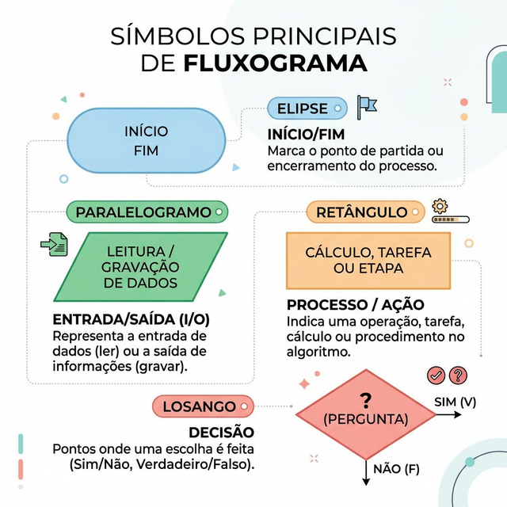
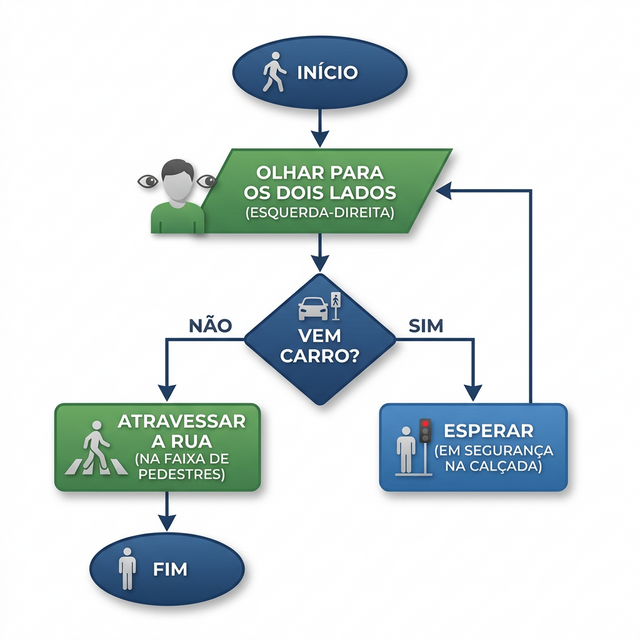

# Aula 1 — Introdução à Programação 🚀

<br><br>

## 🎯 O que é Programação?

Programação é o processo de escrever instruções para que um computador execute tarefas e resolva problemas.

Pense nisso como uma **receita de bolo**: o computador seguirá cada passo exatamente como você escreveu.

<br><br>

---

<br><br>

## 🏛️ O que é um Algoritmo?

Um **Algoritmo** é uma sequência finita de passos bem definidos para resolver um problema.

Tudo pode ser um algoritmo:
*   Amarrar os sapatos.
*   Fazer um café.
*   Calcular a média de um aluno.

<br><br>

---

<br><br>

## 🏗️ Estrutura de um Algoritmo

Todo algoritmo segue este ciclo básico:

1.  **Entrada:** Dados (ex: olhar para os lados).
2.  **Processamento:** Lógica/Ação (ex: decidir se pode atravessar).
3.  **Saída:** Resultado (ex: chegar do outro lado).

<br><br>

---

<br><br>

## 🗺️ Fluxograma: Entendendo na Prática

O fluxograma é a representação visual de um algoritmo. Usamos formas para cada tipo de ação.



<br><br>

---

<br><br>

### Exemplo: Atravessar a Rua 🚦

Abaixo, vemos como o cérebro (ou um robô) decide atravessar a rua com segurança:



<br><br>

---

<br><br>

## 📝 Desafio Rápido (Lógica)

Tente desenhar no papel ou na mente: **Como seria o fluxograma para "Fazer um Café"?**

**Dica:** Não esqueça da decisão: "O café já está doce?".

<br><br>

---

<br><br>

## ❓ Dúvidas até aqui?

Se você sentiu dificuldade na lógica do fluxograma, pare agora e tente resolver os exercícios extras focados em lógica:

👉 **[Ir para Exercícios Extras](exercicios.md)**

---

<br><br>

## 📜 Entrando no Código: Portugol

Agora que entendemos a lógica, vamos escrevê-la de uma forma que pareça código, mas em português. 

Vamos usar o **Portugol WebStudio**.

<br><br>

---

<br><br>

### Olá Mundo em Portugol

```portugol
programa {
  funcao inicio() {
    escreva("Olá, Desenvolvedor!")
  }
}
```

<br><br>

---

<br><br>

### Atravessar Rua em Portugol (Exemplo)

```portugol
programa {
  funcao inicio() {
    escreva("Olhando para os dois lados...\n")
    logico vemCarro = falso // Simulação
    
    se (vemCarro == verdadeiro) {
      escreva("Aguarde o carro passar.")
    } senao {
      escreva("Pode atravessar com segurança!")
    }
  }
}
```

<br><br>

---

<br><br>

## 🏋️ Sua vez (Portugol)

Agora é com você! No **Portugol WebStudio**:
1. Implemente o código de **"Fazer um Café"** seguindo a lógica que discutimos no fluxograma.
2. **Desafio Extra:** Crie um programa que peça dois números ao usuário e mostre a **Soma** deles.

<br><br>

---

<br><br>

## 💻 Finalmente: Linguagem C

A Linguagem C é a base de quase tudo o que usamos hoje. A sintaxe muda um pouco, mas a lógica (o algoritmo) é a mesma!

<br><br>

---

<br><br>

### Olá Mundo em C

```c
#include <stdio.h>

int main() {
    printf("Olá, Desenvolvedor!\n");
    return 0;
}
```

<br><br>

---

<br><br>

### Atravessar Rua em C (Exemplo)

```c
#include <stdio.h>

int main() {
    int vemCarro = 0; // 0 para Não, 1 para Sim

    printf("Vem carro? (1 para Sim / 0 para Nao): ");
    scanf("%d", &vemCarro);

    if (vemCarro == 1) {
        printf("Aguarde!\n");
    } else {
        printf("Pode atravessar!\n");
    }

    return 0;
}
```

<br><br>

---

<br><br>

## 🏋️ Sua vez (Linguagem C)

Agora no seu [Dev-C++](../../programas/config_ambiente.md), vamos repetir os passos:
1. Implemente o código de **"Fazer um Café"** (utilize `printf` para os passos e um `if` para perguntar se quer açúcar).
2. **Desafio Final:** Crie um programa que:
   - Peça dois números inteiros.
   - Calcule a soma.
   - Exiba: "O resultado da soma é: [RESULTADO]".

<br><br>

> *"A programação é a arte de explicar ao computador como resolver o seu problema."*
